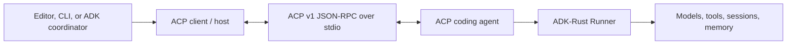
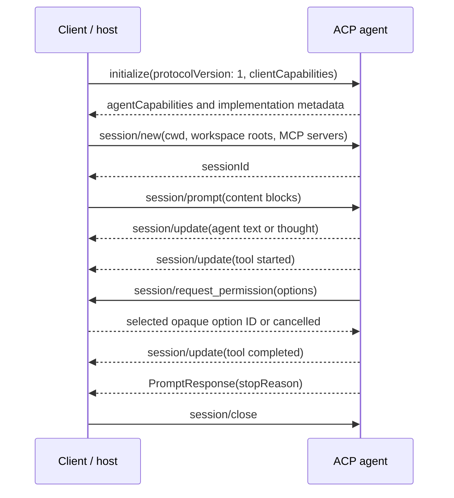

# Agent Client Protocol architecture

ACP standardizes the relationship between a coding interface and a coding
agent. It gives them a common way to establish capabilities, open a project
session, exchange prompts, stream progress, request permission, cancel work,
and close or resume the session.

## The two roles

| Role | Responsibilities |
|---|---|
| Client / host | Starts the agent process, presents the human interface, selects the workspace, supplies optional files, terminals, and MCP servers, applies permission policy, and renders live updates |
| ACP agent | Accepts project sessions and prompts, performs coding work, reports messages and tool activity, asks for permission where needed, and returns a typed stop reason |

ADK-Rust can occupy either role. These are two deployment directions, not two
different protocols.

When ADK-Rust consumes another coding agent, the left side is ADK-Rust and the
right side is the external process. When an editor consumes an ADK-Rust agent,
the editor owns the left side and `AcpServer` owns the right side.

## One ACP turn

The connection is bidirectional. A client must keep reading while a prompt is
running because the agent may send notifications or permission requests before
the final prompt response.

## Session identity and state

An ACP session identifies a continuing conversation about one project. It
contains an absolute `cwd`, optional additional directories, multiple prompts,
streamed updates, and a lifecycle. In the ADK-Rust server, one ACP session maps
to one ADK-Rust session so model history and session state remain attached to
the same conversation.

Closing an active connection is different from deleting persisted history:

- `session/close` releases the active session and its processes;
- `session/resume` attaches to persisted ADK session state;
- `session/load` reactivates a persisted session and replays its stored
  conversation to the client as ordered `session/update` notifications before
  the request completes;
- `session/fork` branches a persisted session into a new session id whose stored
  history is a copy of the source's, leaving the source untouched;
- `session/delete` removes the persisted session;
- `session/list` returns sessions visible through the configured
  `SessionService`.

`session/load` validates the supplied `cwd` against the session's stored working
directory the same way `session/resume` does, and returns a session-not-found
error for an unknown session identifier. Replay maps each stored user, agent,
thought, and tool event to its corresponding `SessionUpdate` variant in original
chronological order, so a reconnecting editor restores the visible history in
the order it happened.

## Interactive session controls

An agent may expose interactive controls to the client by supplying a
`SessionControls` provider. When it does, the server advertises them in the
`session/new`, `session/load`, `session/resume`, and `session/fork` responses:

- **Modes** — a set of named modes (for example "ask" versus "code") with a
  current selection. `session/set_mode` validates the requested mode against the
  advertised set, records it, and emits a `CurrentModeUpdate`; an unknown mode is
  rejected and the current mode is unchanged.
- **Configuration options** — selects and toggles a client can read and change.
  `session/set_config_option` validates the value against the option's declared
  choices, records it, and emits a `ConfigOptionUpdate`; an unknown option or an
  invalid value is rejected.
- **Available commands** — ACP slash-commands surfaced as an
  `AvailableCommandsUpdate` when a session becomes active.

Mode and configuration selections persist in ADK session state (`acp:mode`,
`acp:config:<id>`), so they survive load, resume, and fork. A recorded session
title surfaces as a `SessionInfoUpdate` on activation and whenever it changes. A
`Plan` update mapping exists but stays dormant until an ADK plan primitive
surfaces plan entries. An agent that supplies no `SessionControls` advertises no
modes and no options, keeping advertised capabilities exactly aligned with what
the server implements.

## Content crosses the boundary through one mapping

Prompts arriving from a client and updates streaming back to it both pass
through a single content module that maps ACP `ContentBlock` values to
`adk_core::Part` values and back. Keeping one mapping in both directions means
the server prompt parser, the server streamer, and the client all agree on how
each content type is represented.

The mapping preserves payloads faithfully. Text blocks map to `Part::Text` with
the string intact. Embedded-resource blocks map to `Part::EmbeddedResource`,
keeping the source URI, the optional MIME type, and the contents. A text
resource travels verbatim in both directions and is never base64-encoded; a
binary resource is base64-encoded on the wire and decoded to raw bytes on the
ADK side of the boundary. Image and audio blocks map to `Part::InlineData`,
preserving the MIME type and decoded bytes; the server advertises and accepts
those prompt media, and the client transmits non-text ADK content (embedded
resource, image, audio) as the matching ACP block rather than dropping it.

## Streaming updates carry more than text

While a prompt runs, the server translates typed ADK events into ACP
`session/update` notifications. Model text and thoughts become message and
thought chunks, and embedded-resource content becomes an embedded-resource
message chunk. Beyond that surface, two kinds of update give a client a richer
view of the turn:

- **Usage updates.** When an ADK event carries usage metadata, the server sends
  a `UsageUpdate` reflecting the reported token counts, plus cost in USD when
  the runtime reports it. Events without usage metadata produce no update, and
  the server never fabricates counts.
- **Rich tool-call updates.** A tool call starts as a `ToolCall` with a tool
  `kind` inferred from the tool's declared behavior. Its later `ToolCallUpdate`
  carries the tool result content and the file locations the tool reports it
  affected, so an editor can render diffs and affected-file lists. The update
  keeps the same identifier as the originating `ToolCall`, preserving
  correlation across the turn.

The client direction has the matching fidelity. When an ADK-Rust application
consumes an External_Agent, its streaming surface (`OutputChunk`) exposes not
only agent text and thoughts but also the External_Agent's `ToolCallUpdate` (as
an id-correlated tool-update carrying status, kind, title, content text, and
affected file locations) and its `UsageUpdate` (tokens used and size, plus cost
and currency when reported). Agent message text is surfaced exactly as before,
so existing text consumers are unaffected.

## Permission requests bridge tool confirmations

An ADK-Rust agent can pause a turn pending human approval of a tool call
(`ToolConfirmationRequest`). On the server side, that pause becomes a native ACP
`session/request_permission` request describing the tool and its arguments. The
client's outcome resumes the turn: an approval maps to allow, and a denial or a
cancellation both map to deny, so a cancelled request never executes the tool.
Each outcome is correlated to the exact call by its function-call identifier and
fed back to the runner through its tool-confirmation decisions. The nested
permission request is issued from the spawned prompt task, so the outer
`session/prompt` response still completes normally.

## Capabilities are a contract

Initialization is not a decorative handshake. Each side advertises only the
operations and content it supports. ADK-Rust uses those capabilities to avoid
sending optional HTTP or SSE MCP configuration to an agent that accepts only
stdio, and it advertises filesystem or terminal host operations only when the
application supplies the corresponding implementation.

The server advertises exactly the content types its prompt handler accepts. It
advertises the `embedded_context`, `image`, and `audio` prompt capabilities
because embedded-resource content maps to `adk_core::Part::EmbeddedResource` and
image and audio content map to `adk_core::Part::InlineData`. It advertises
`load_session` because it registers a `session/load` handler, and the `fork`
session capability because it registers a `session/fork` handler. Session modes
and configuration options are advertised only when the agent supplies a
`SessionControls` provider, so an agent without one advertises neither. Remote
transports, model selectors, and experimental protocol additions remain
unadvertised. A prompt carrying a content type the server has not advertised is
rejected with a descriptive error rather than partially handled. Callers should
design against the negotiated capability object rather than assuming every ACP
implementation has the same surface.

## Next

- [Build an ACP client or host](client.md)
- [Expose an ADK-Rust ACP agent](server.md)
- [Testing and support matrix](testing.md)
